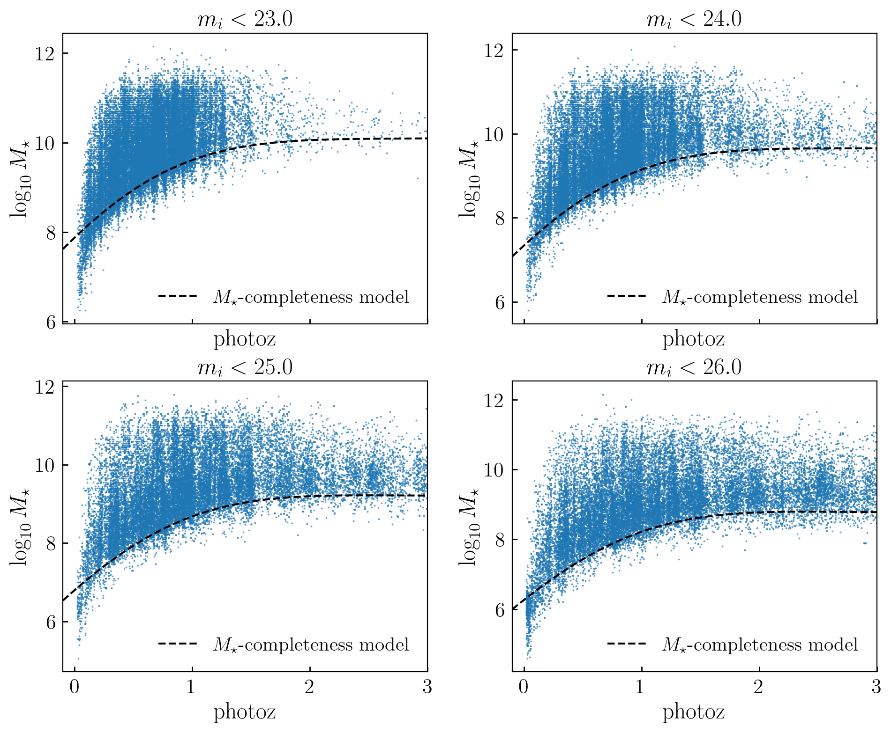
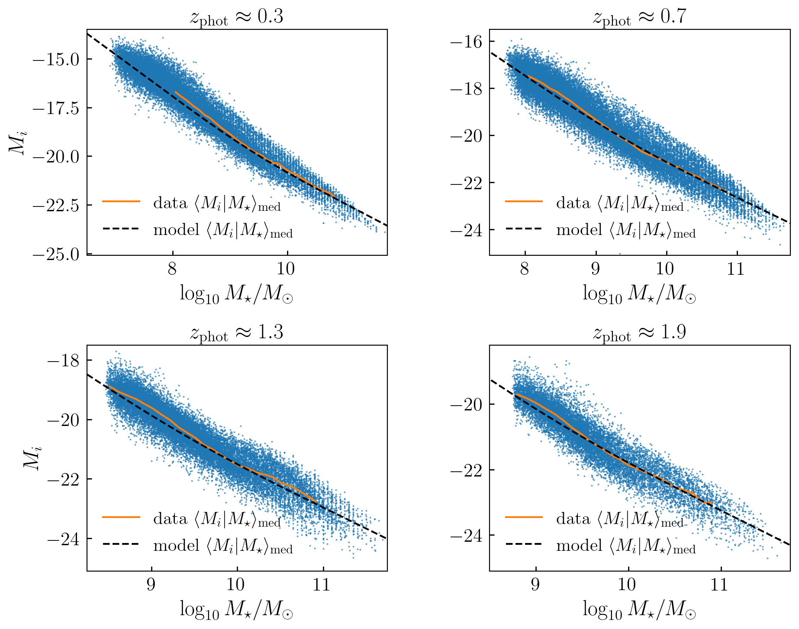

Target Data Models
====================

The `cosmos20_colors <https://github.com/aphearin/cosmos20_colors/>`__ package
includes approximate models for various summary statistics of COSMOS-20 galaxies,
which we generically refer to as "target data models".
Such summary statistics are commonly used to calibrate the parameters of models
of the galaxy--halo connection, and the purpose of the target data models
is to simplify this calibration process, and to improve the reliability of
extrapolations into various regimes of the data.

Completeness Models
-------------------

Many of the target data models in the package are defined
after first making some kind of completeness cut on the COSMOS-20 dataset,
so that the measured summary statistics
are not impacted by the depth limit of the survey.

Stellar Mass Completeness
^^^^^^^^^^^^^^^^^^^^^^^^^

One form of target summary statistics that is very convenient for galaxy--halo modeling
is a probability distribution conditioned upon stellar mass and redshift,
for example :math:`P(g-r\vert M_{\star},z)`, the distribution of :math:`g-r` color
for a sample of galaxies with the same stellar mass and redshift.
Measuring such summary statistics at any given redshift requires
a complete sample of galaxies of mass :math:`M_{\star}.`
The :meth:`get_logsm_completeness <~cosmos20_colors.target_data_models.logsm_completeness.get_logsm_completeness>` function
provides an approximate model for stellar mass completeness as a function of both
redshift and the cut on apparent magnitude in the HSC i-band.

For any choice of :math:`23 < m_i < 26`, :math:`90-95\%` of galaxies in the COSMOS-20
dataset are more massive than the dashed black curve in the above plot.

Models for Absolute Magnitude
-----------------------------

One of the key quantities that impacts the luminosity function is
:math:`\langle M_{x}\vert M_{\star}, z\rangle`, the average absolute magnitude
(in some band :math:`x`) as a function of stellar mass and redshift.

i-band Magnitude
^^^^^^^^^^^^^^^^^^^^^^^^^

The :meth:`median_hsc_imag_model <~cosmos20_colors.target_data_models.median_imag_model.median_hsc_imag_model>` function
provides an approximate model for median absolute magnitude in the HSC i-band
as a function of redshift and stellar mass.

